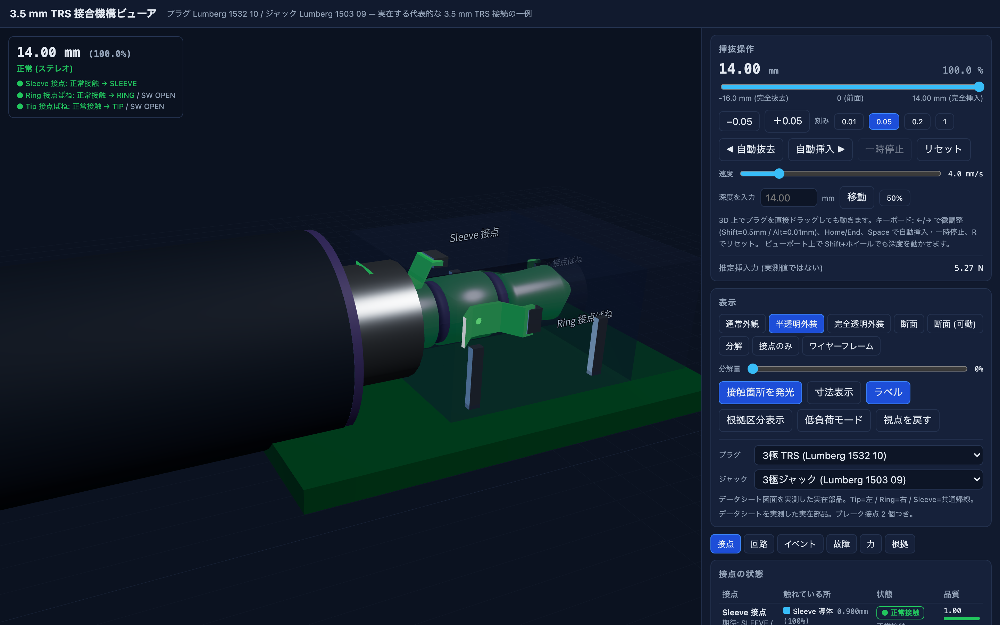
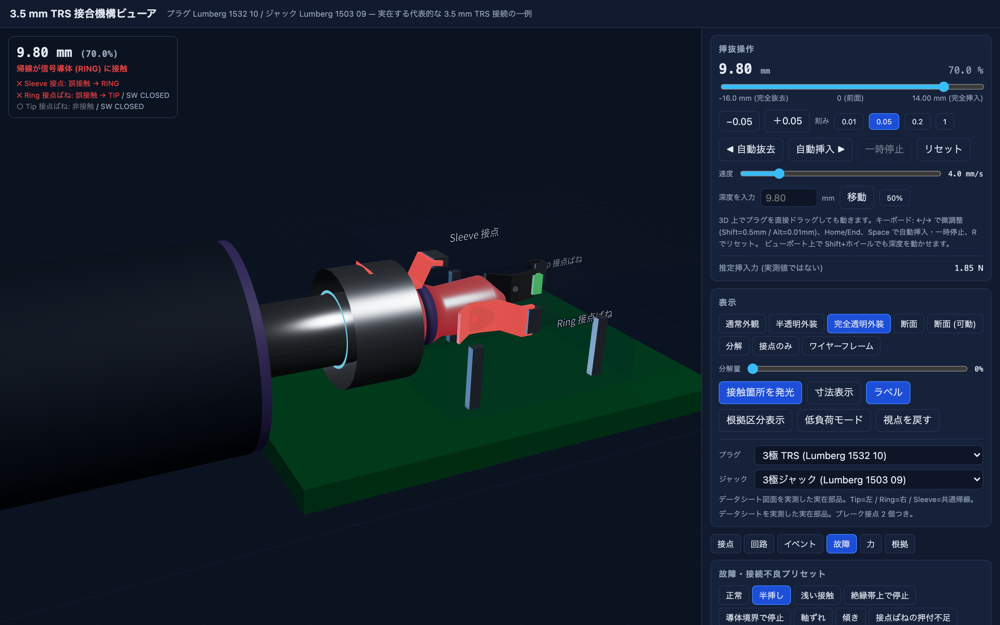
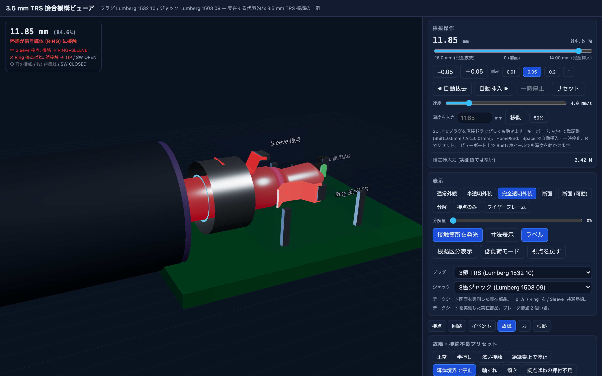
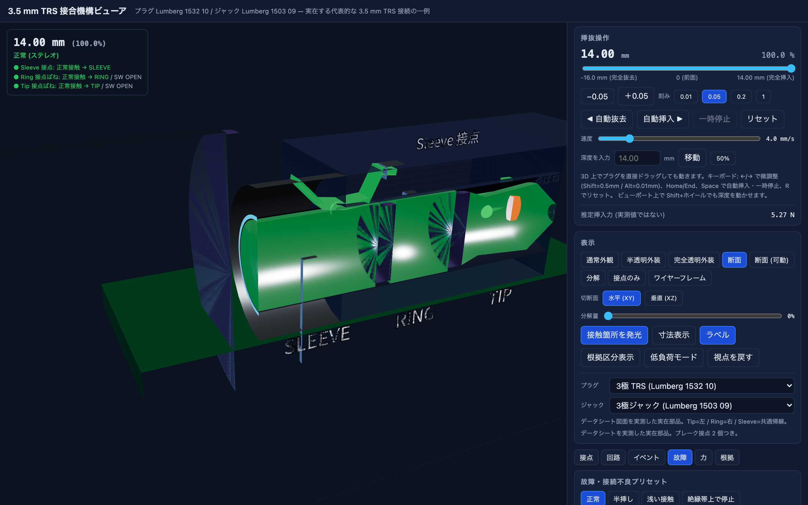

# 3.5 mm TRS 接合機構ビューア

実在する 3.5 mm ステレオプラグとジャックの**接合機構**を、ブラウザ上で自由に観察・挿抜できる 3D アプリです。

> 一番の狙いは、**プラグを途中まで挿したときに内部で何が起きているか**を、
> 見た目の色替えではなく実際の幾何計算で見せることです。

### 使える用途／使えない用途

**先にここを読んでください。**判断が分かれるのはこの 1 点だけです。

| | |
|---|---|
| ✅ **使える** | 半挿しのときに接点がどの順で何に触れるかを理解する／教材にする／「片方しか鳴らない」「ガリッとノイズが出る」といった故障の説明に使う／接合機構の形と動きを見る |
| ❌ **使えない** | 設計値の根拠にする／調達や部品選定の判断に使う／実物の寸法として引用する |

理由は 2 つです。**ジャック内部の寸法は 20 件の仮定を含み**（仮定は全体で 41 件）、
**実物と突き合わせた検証がまだ済んでいません**（[UNKNOWNS.md](UNKNOWNS.md)）。
外形はメーカー公開図面どおりですが、**内部は図面にもデータシートにも書かれていません**。

またモデル化したのは下の 2 型番の組み合わせ **1 組だけ**です。
「実在する代表的な 3.5 mm TRS 接続の一例」であって、3.5 mm ジャック全般の代表ではありません。

- **プラグ**: Lumberg **1532 10** — JIS C 6560 JC35P3、3.5 mm、3極ステレオ、ストレート型
- **ジャック**: Lumberg **1503 09** — JIS C 6560 JC35J3B、3.5 mm、3極ステレオ、アングル型、ブレーク接点 2 個つき

この 2 つは、メーカー自身が対応品として互いに列挙している実在の組み合わせです。

### 言葉づかい

タイトルの **TRS** は、プラグの 3 つの導体 **T**ip（先端）／**R**ing（中間）／**S**leeve（根元）の頭文字です。
ステレオなら Tip = 左、Ring = 右、Sleeve = グランド（帰線）に使われます。

| 語 | 意味 |
|---|---|
| **絶縁帯** | 導体と導体のあいだの、電気を通さない黒い帯。ここに接点が乗ると回路が開く |
| **橋絡（きょうらく）** | 1 つの接点が**隣り合う 2 つの導体に同時に触れて**しまい、両者が短絡すること |
| **ブレーク接点** | ジャックに内蔵されたスイッチ。プラグを挿すと押し開かれて開く。機器はこれで「挿さった」を検知する |
| **パッド** | ジャック側接点のうち、実際にプラグへ触れる面。幅を持つので複数の導体にまたがりうる |
| **プラトー** | プラグ外形のうち、半径が同じで平らな区間（Ring と Sleeve はどちらも φ3.5 で同じ高さ） |

| 完全挿入 | 半挿し（帰線接点が Tip 導体に触れている） |
|---|---|
|  |  |

| 橋絡（Ring と Sleeve が同時に短絡する深さ） | 断面 |
|---|---|
|  |  |

<sub>いずれも `npm run screenshots` が実ブラウザを操作して生成したものです（加工していません）。</sub>

---

## 何が見えるのか

| できること | 説明 |
|---|---|
| 自由な視点 | 回転・拡大縮小・移動。「視点を戻す」で既定位置へ |
| 連続的な挿抜 | ドラッグ／スライダー／キーボード／ホイール／自動アニメ。**任意の深度で停止できる** |
| 内部の可視化 | 半透明・完全透明・断面・可動断面・分解・接点のみ・ワイヤーフレーム |
| 接点状態 | どのジャック接点が Tip / Ring / Sleeve のどこに触れているかを実時間表示 |
| 異常の区別 | 絶縁帯上・誤電極・橋絡（短絡）・不安定接触を別々の状態として区別 |
| ブレーク接点 | 内蔵スイッチ 2 個の開閉を表示 |
| 電気回路 | 端子とプラグ導体の接続グラフを 3D と同期表示 |
| イベント | 挿入経路上の重要な位置を自動抽出し、クリックでその深度へ移動 |
| 故障モード | 半挿し／絶縁帯停止／橋絡／軸ずれ／傾き／押付不足／摩耗／汚れ／断続接触 |
| 根拠の追跡 | 全ての寸法に FACT / DERIVED / ASSUMPTION の区分と出典を表示 |
| 4極 (TRRS) | CTIA / OMTP を別プリセットとして追加。3極ジャックとの混挿も幾何から計算 |

---

## 起動手順

```bash
npm install
```

```bash
npm run dev
```

ブラウザで `http://localhost:5173` を開きます。

### その他のコマンド

| コマンド | 内容 |
|---|---|
| `npm run test` | 単体テスト (Vitest) 166 件 |
| `npm run typecheck` | TypeScript 型検査 (`src` / `scripts` / `test`) |
| `npm run build` | 本番ビルド |
| `npm run artifacts` | `artifacts/` へ走査結果 JSON を生成 |
| `npm run sensitivity` | 仮定パラメータの感度解析（**15 分ほどかかる。CI 向けではない**） |
| `npm run docs:html` | `docs/*.md` から `docs/*.html` を生成 |
| `npm run export:half-plug` | 接点トポロジーを DSP 非依存の JSON として書き出す（→ [連携](#half-plug-lab-との連携)） |
| `npm run search:topology -- --target DIFFERENCE_SIGNAL` | 目標トポロジーが成立する構成を探す（**約 10 分**） |
| `npm run screenshots` | 実ブラウザ (Playwright) で UI を操作し、`docs/screenshots/` へ画像を保存 |
| `npm run perf` | 実 GPU (headed Chrome) でフレームレートと描画コストを測定 |
| `npm run touch` | iPhone/iPad 相当のビューポートにタッチ入力を注入して操作を検証 |
| `npm run predict:probe` | テスターで測れる形の予測を出力（実物との突き合わせ用） |
| `npm run fit:contacts` | 実測した切り替わり深さから接点の軸位置を逆算 |
| `npm run inspect` | モデルの挙動をコンソールに出力 (開発用) |

`npm run screenshots` / `npm run perf` / `npm run touch` は `npm run dev` が別ターミナルで動いていることが前提です。
`npm run perf` は実 GPU を使うため Chrome のウィンドウが一時的に開きます。

---

## 操作方法

**挿抜**

- 3D 上でプラグを直接ドラッグ
- スライダー、数値入力 + 「移動」、`50%` ボタン
- `←` `→` … 微調整（`Shift` = 0.5 mm、`Alt` = 0.01 mm、既定は選択中の刻み）
- `Home` / `End` … 完全抜去 / 完全挿入
- `Space` … 自動挿入の開始・一時停止、`R` … リセット
- ビューポート上で `Shift` + ホイール … 深度の微調整（ホイール単独は拡大縮小）
- 刻みは 0.01 / 0.05 / 0.2 / 1 mm から選択

**視点**

- ドラッグ … 回転、ホイール … 拡大縮小、右ドラッグ … 平行移動

---

## 座標系

```
        ジャック前面基準面 (ローレットナット前面)
                    │
   未挿入 ←── d<0   │   d>0 ──→ 奥
                    │
   d = 0 : プラグ先端がちょうど前面にある
   d = 14.0 mm : プラグ肩が停止面に当たる完全挿入
```

- `d` … 挿入深度 [mm]。**ジャック前面基準面からプラグ先端までの距離**
- `s` … プラグ先端からの軸方向距離 [mm]。セグメント境界はこの座標で定義
- 対応関係 … `s = d − (接点の軸位置)`

完全挿入深度 14.0 mm は、**プラグ肩の外径 φ10 がジャックのボア φ3.6 より大きく、
肩が前面に当たって止まる**ことから導出しています（推測ではなく幾何的帰結）。

---

## モデルの構造

```
src/
  data/          寸法・接点・材料・出典・故障プリセット (JSON)。数値はすべてここだけにある
  model/         接触判定・回路・力・走査。3D にもブラウザにも依存しない純粋 TypeScript
  three/         3D 形状生成と表示。data/model からしか数値を受け取らない
  ui/            パネル類
  store/         操作状態 (zustand)
```

**接触判定は 3D メッシュ名にも画面座標にも物理エンジンにも依存しません。**
プラグの軸方向区間・接点パッド幅・ばね変位から決定論的に計算しています。
同じ入力なら常に同じ出力になることをテストで担保しています。

---

## 半挿しで何が起きるか

このアプリの中心的な発見です。物語ではなく、幾何計算の結果として出てきます。

ジャックの 3 つの接点は軸方向にばらばらの位置にあります。
**前面から 帰線 3.2 / Ring 7.1 / Tip 11.4 mm**（3 つとも一次資料に無い **ASSUMPTION**）。
プラグを挿していくと、**入口に一番近い「帰線（グランド）用の接点」が、
まずプラグの Tip（左チャンネル）の上を通り、次に Ring（右チャンネル）の上を通ります。**

### この表を読む前に — 深さは幅を持ちます

下の表は**ジャック内部の接点位置とパッド幅を、現在の仮定値に固定した**ときの計算結果です。
それらは一次資料に無い仮定なので、**深さの数字はそのぶん動きます。**

| 事象 | 下表の値 | 仮定を成立範囲いっぱいに振ったときの幅 |
|---|---:|---|
| Ring↔Sleeve 橋絡が始まる | 11.78 mm | **6.96〜13.14 mm** |
| Ring 側ブレーク接点が開く | 8.06 mm | **8.00〜12.33 mm** |

**振れは最大 4.8 mm、しかも方向が事象ごとに違います。**
橋絡は下へ **−4.82** / 上へ +1.36、ブレーク接点は下へ −0.06 / 上へ **+4.26**。
`±◯ mm` のような対称な誤差ではありません。
下表の 2 桁の数字を確定値として持ち帰らないでください
（測り方は [docs/SENSITIVITY.md](docs/SENSITIVITY.md)）。

**さらに、表の全体が一律にずれる可能性もあります。**帰線接点を前面から 3.2 mm に
置いていますが、この値は同じリポジトリが記録する入口ブッシングの寸法と噛み合っていません。
両立させると接点は 3.95〜4.55 mm となり、**橋絡を含む全ての深度がちょうど +1.0 mm ずれます**
（状態の並び・区間幅・完全挿入時の結線はいずれも変わりません）。
上の「幅」とは別種の、**表全体に効く系統的なずれ**です（[UNKNOWNS.md](UNKNOWNS.md) §3-8）。

**一方、「何が起きるか」の順序は幅を持ちません。** 帰線接点が Tip → Ring の順に通過すること、
その過程で Ring↔Sleeve の橋絡が起きること、**Tip↔Ring の橋絡は起きないこと**、
ブレーク接点が正しい結線より先に開くこと ―― これらは仮定をどう選び直しても変わりませんでした。

**「何が起きるか」はほぼ決まっていて、「何 mm で起きるか」が決まっていない**、という状態です。

### 深さごとの計算結果

> **表中の数字はすべて 0.02 mm 刻みの走査値です**（正本は `artifacts/events.json`）。
> 走査は刻みの倍数でしか値を出せないので、実際の切り替わりはその刻みの間にあります。
> **これはモデル内部の値であって、実物を測った値ではありません。**

右の列は、**帰線接点の軸位置とパッド幅を成立範囲いっぱいに振った 869 構成**での幅です。
**「—」は測っていないという意味で、動かないという意味ではありません。**

| 深度 | 起きること | 帰線接点を振ったときの幅 |
|---|---|---|
| 3.92 mm | 最初の物理接触。帰線用接点がプラグ先端の円錐に触れる | **-0.88〜5.72** |
| 3.94 mm | 最初の電気接触。**帰線用接点が Tip 導体に接触**（左チャンネルがグランドに落ちる） | **-0.86〜8.02** |
| 6.32〜7.04 mm | 帰線用接点が第1絶縁帯を通過し、いったん回路が開く | — |
| 8.02 mm | Ring 用接点が Tip 導体に接触（右チャンネルの線に左の信号が乗る） | — |
| 8.06 mm | **Ring 側ブレーク接点が開く** — 機器は「挿さった」と判断するが、まだ何も正しくつながっていない | 動かず（※） |
| 8.26〜8.28 mm | 帰線用接点が第1絶縁帯の上を通る。**ここでは橋絡しない**（下記） | — |
| 9.44 mm | Ring 側ブレーク接点がいったん閉じ直す（先端の細くなる部分をばねが下るため） | — |
| 11.24 mm | Ring 側ブレーク接点が再び開く | — |
| 11.78 mm | **橋絡発生**。帰線用接点が第2絶縁帯をまたぎ、**Ring と Sleeve を同時に短絡**する | **6.98〜13.14** |
| 11.96 mm | 橋絡が解消し、帰線用接点がようやく Sleeve だけに乗る | — |
| 12.34 mm | ようやく全接点が正しい導体に接触 | **12.34〜14.00** |
| 14.00 mm | 完全挿入 | 動かない（幾何で決まる） |

> **（※）ブレーク接点の「動かず」は要注意です。**振ったのは帰線接点の 2 つだけなので、
> **ブレーク接点は自分のパラメータを振られていません。**その開くしきい値
> （0.05 mm・ASSUMPTION）を成立範囲で振ると、開く深さは **8.00〜12.33 mm** まで動き、
> 0.4 以上では一度も開きません。「幅 0」は**この振り方では動かない**という意味です。
>
> **二分法で詰めた値**（走査刻みに依存しない値）が分かっているのは 2 つだけです。
> 橋絡の開始 **11.760**、終了 **11.94**。表の 11.78 / 11.96 は 0.02 mm 刻みの走査値なので、
> その差が刻みの粒度です。**どちらもモデル内部の値で、実物の値ではありません。**

つまり **「半挿しでガリッとノイズが出る」「片方しか鳴らない」「機器は挿入を検知しているのに音がおかしい」**
のいずれも、この 10 mm ほどの間に順番に起きています。

> この表は [docs/REPORT.md](docs/REPORT.md) §4 にも同じものがあります。**文言は用途に合わせて
> 別々に書いていますが、深さの数字は `npm run test` が両方とも `artifacts/events.json` と
> 突き合わせています**（`test/docs.test.ts`）。表そのものは自動生成していません
> ——第2列の因果の説明は生成物に無いためです。

### 橋絡が第2絶縁帯でだけ起きる理由

一見すると、**パッド 0.9 mm が絶縁帯 0.7 mm より広い**のだから、どちらの絶縁帯でも
両側の導体に同時に触れそうに見えます。しかしそれは軸方向しか見ていません。

**プラグの導体には高さの差があります。**Tip だけが細いのです。

| 導体 | 外半径 | 直径 |
|---|---|---|
| Tip | 最大 **1.600** mm | φ3.20 |
| Ring | **1.750** mm | φ3.50 |
| Sleeve | **1.750** mm | φ3.50 |

接点はパッドの範囲内で**一番高い面に乗って押し開かれます**。
そこから下は、ごくわずかしか追従できません。だから絶縁帯の**両側が同じ高さかどうか**で
結果が分かれます。

| 絶縁帯 | 片側 | もう片側 | 高さの差 | 橋絡 |
|---|---|---|---|---|
| **第1**（Tip ↔ Ring） | Tip **1.600** | Ring **1.750** | **0.15 mm ある** | ❌ 起きない |
| **第2**（Ring ↔ Sleeve） | Ring **1.750** | Sleeve **1.750** | **0（同じ高さ）** | ✅ 起きる |

第1絶縁帯では接点が**高いほうの Ring に乗る**ため、0.15 mm 低い Tip の面には届きません。
第2絶縁帯では両側が同じ高さなので、パッド 0.9 mm が 0.7 mm の隙間をまたいで両方に届きます。

実際の形は、冒頭の**断面**と**橋絡**のスクリーンショットで見られます
（[断面](docs/screenshots/04_section.png) ／ [橋絡](docs/screenshots/03_bridged.png)）。
アプリ上では「断面」表示にして深度 11.8 mm 付近まで挿すと、この状態が再現できます。

つまり橋絡の成立条件は「パッド幅 > 絶縁帯幅」ではなく、
**「同じ高さの導体面どうしの間隔（0.700 mm）< パッド幅（0.9 mm）」**です。

> **どちらが正しいかは実物で決着できます** → [docs/VERIFICATION_PLAN.md](docs/VERIFICATION_PLAN.md)
> （この判定は 2026-07-31 に一度直しています。経緯は [CHANGELOG.md](CHANGELOG.md)）

なおこの結論は、**仮定の選び方に依存しません**。

接点のドームは、押し上げられた位置から**少しだけ下の面まで追従できます**。この追従量を
`compliance`（コンプライアンス）と呼んでいます。**単位は mm で、これも仮定値です。**

接点が Tip 面に届いてしまう条件は「追従量 ≥ Ring と Tip の半径差」、つまり
**`compliance ≥ 0.150 mm`**。この式にパッド幅も接点位置も出てきません。
**だからそれらをどう仮定し直しても結論が変わらない**のです。

実際に測った境目は **0.1538 mm** です。上の式の 0.150 との差 0.0038 は、
「触れている」と判定するのに要する最小の重なりぶんで、Tip 後端の斜面の上で稼ぐ必要があります。
**床の 0.150 のほうは、その判定基準を変えても動きません。**

採用している追従量は **0.05 mm**。境目 0.1538 の約 1/3.1 です。
境目未満の範囲を 864 通り埋めて走査しても、Tip の橋絡は 1 度も出ませんでした。

> **ただし「1/3.1」を余裕としてそのまま持ち帰らないでください。**これは
> **公称寸法かつ追従量 0.05 のとき**の比です。次の 2 つを同時に悪い側へ振ると、余裕は縮みます。
>
> | | 境目 | 追従量 0.05 との比 |
> |---|---|---|
> | 公称寸法 | 0.1538 | 3.08 倍 |
> | 図面公差の最悪コーナー（φ3.45 × 絶縁帯 φ3.22） | **0.1189** | **2.38 倍** |
>
> さらに追従量そのものの採用**範囲**は 0.02〜0.10 mm です
> （[UNKNOWNS.md](UNKNOWNS.md) §3-6）。**その上端 0.10 と最悪コーナーを組み合わせると、
> 余裕は 1.19 倍**しか残りません。結論は保たれますが、3.1 倍とはまったく違う強さの主張です
> （[docs/SENSITIVITY.md](docs/SENSITIVITY.md) §6-1）。

---

## Half-Plug Lab との連携

このプロジェクトは元々、**「有線イヤホンを半挿しにすると音の質感が変わる」現象を
無線イヤホンで再現したい**という目的から始まりました。その音響エミュレーター
（Half-Plug Lab）へ、接点のつながり方を渡すための出口が `npm run export:half-plug` です。

```
trs-jack-3d          決定論的な幾何・接点・回路グラフ
      ↓
Half-Plug Topology Profile v1     ← 中立 JSON。ここが境界
      ↓
Half-Plug Lab                     DSP 状態候補への写像は向こう側の責任
```

**この JSON は音響係数ではありません。**渡しているのは「どの端子とどの導体が
つながっているか」という**電気的なつながり方**だけです。次の変換は明示的に禁じています。

- `quality`（相対スコア）を接触抵抗 Ω やゲインへ換算する
- 音響の分類をフィルタ係数として扱う
- 1 機種の mm 値を一般的な「挿入深度」として使う（`normalized` を併記しています）
- 実測していない profile に「実物と同じ」と表示する

### この既定モデルでは「共通帰線断」が起きません

半挿しの音として有力な候補は **帰線（グランド）が浮く**状態ですが、
**この Lumberg の組み合わせの既定モデルでは、その状態が一度も現れません。**
現れるのは誤接触・左右短絡・無音・正常接続です。

profile はこれを `absentTopologies` として**機械可読な「不在」の記録**にしています。
**表示上だけ足すことはしません。**

### 3極プラグを 4極ジャックへ半挿しにすると、無改造で起きます

`npm run search:topology -- --target DIFFERENCE_SIGNAL` で、接点の軸位置・パッド幅・
接触ドームの追従量を振り、**14,670 構成**を調べました。

| | 件数 |
|---|---:|
| 完全挿入を壊さずに成立する構成 | **240** |
| うちパッド幅 0.3 mm 以上（製造しうる） | **159** |
| うち**既定値から 1 つも動かさないもの** | **1** |

| variant | 成立 | 製造しうる | 無改造 |
|---|---:|---:|---:|
| 3極プラグ × 3極ジャック | 78 | 51 | 0 |
| 4極 CTIA × 4極ジャック | 0 | 0 | 0 |
| **3極プラグ × 4極ジャック** | **162** | **108** | **1** |

**3極プラグを 4極ジャックへ挿す構成は、何も改造せずに成立します。**

```
深さ 12.9〜13.1 mm（幅 0.2 mm）で
   L → Tip 導体 ／ R → Ring 導体 ／ 帰線 → どこにも触れず
```

4極ジャックの帰線接点が、3極プラグの絶縁帯にちょうど落ちるためです。
**スマホ用の 4極ジャックに、ふつうの 3極イヤホンを半挿しにする**という、
特別な部品を要さない構成です。

### ただし、この結論が乗っている土台

**4極ジャックの接点位置 4 件は、一次資料がなく全て ASSUMPTION です**
（[UNKNOWNS.md](UNKNOWNS.md) §5-2）。「既定値のまま起きる」は
**「こちらが仮定した位置のまま起きる」**という意味でしかありません。

ただし**仮定の一点だけに乗ってはいません。** 完全挿入が壊れない 432 構成のうち
**162 件（38 %）**で成立します（3極×3極は 675 中 78 件＝12 %）。

> **現象が起きること**は仮定の振り方に対してかなり頑健ですが、
> **深さ 12.9〜13.1 mm という数字**は仮定した接点位置に完全に依存します。
> 実物で確かめる手順は [docs/VERIFICATION_PLAN.md](docs/VERIFICATION_PLAN.md) です。

探索結果の構成はすべて `evidenceGrade: ASSUMPTION` です。
**「3.5 mm ジャック一般でこうなる」とは言えません。**

---

## 何をどこまで根拠にしているか

| 区分 | 件数 | 意味 |
|---|---:|---|
| FACT | 48 | メーカーデータシートに数値として直接記載されている |
| DERIVED | 39 | 記載寸法から演算、または図面を実測して導出した |
| ASSUMPTION | 41 | 資料が無いため明示的に置いた仮定 |
| UNKNOWN | 0 | （未確認のまま数値化した項目は無い。未確認事項は [UNKNOWNS.md](UNKNOWNS.md) に文章で列挙） |

アプリ内の「根拠」タブで、全ての寸法キーについて値・区分・出典を確認できます。
「根拠区分表示」を押すと 3D の各部品が区分ごとの色に変わります。

- **何がいつ変わったか（訂正の履歴を含む）→ [CHANGELOG.md](CHANGELOG.md)**
- 詳しい出典 → [SOURCES.md](SOURCES.md)
- 仮定の一覧と理由 → [ASSUMPTIONS.md](ASSUMPTIONS.md)
- 未確認事項・資料の矛盾 → [UNKNOWNS.md](UNKNOWNS.md)
- 第三者資料（図面・CAD）の扱い → [THIRD_PARTY_NOTICES.md](THIRD_PARTY_NOTICES.md)
- 検証結果 → [docs/TEST_RESULTS.md](docs/TEST_RESULTS.md)
- **仮定を振ったときに何が動くか → [docs/SENSITIVITY.md](docs/SENSITIVITY.md)**
- **実物との突き合わせ計画 → [docs/VERIFICATION_PLAN.md](docs/VERIFICATION_PLAN.md)**（**実測してくださる方を募集中**。メンテナ自身は実施しません）

**重要**: 外形寸法はメーカー公開図面に基づきますが、**ジャック内部の接点ばねの寸法は
どのデータシートにも CAD にも含まれていません**。内部接点はデータシートの回路記号、
基板レイアウト図の端子位置、および「完全挿入時に正しく結線されねばならない」という
幾何条件から独自に構成したもので、DERIVED または ASSUMPTION です。

また **メーカー CAD は再配布が禁止されているため、本プロジェクトには一切含まれていません。**
3D 形状はすべて公開寸法から自前で生成しています（[THIRD_PARTY_NOTICES.md](THIRD_PARTY_NOTICES.md)）。

---

## 生成される成果物 (`artifacts/`)

| ファイル | 内容 |
|---|---|
| `contact_sweep.json` | 0.02 mm 刻みで全域を走査した接点状態（1451 行） |
| `force_curve.json` | 推定挿抜力曲線と内訳 |
| `events.json` | 挿入経路上の主要イベントと状態変化 |
| `variant_matrix.json` | プラグ 3 種 × ジャック 2 種の全組み合わせ比較 |
| `verification_summary.json` | 寸法検証・完全挿入/抜去時の結線・根拠区分の内訳 |
| `ui_verification.json` | 実ブラウザでの UI 検証 27 項目の結果 |
| `perf_real_gpu.json` | 実 GPU (Apple M5) でのフレームレートと描画コスト |
| `touch_verification.json` | タッチ操作の検証 20 項目の結果 |
| `sensitivity.json` | 仮定パラメータの感度解析の生データ（→ [docs/SENSITIVITY.md](docs/SENSITIVITY.md)） |
| `half_plug_topology_profile.v1.json` | 接点トポロジーの中立表現（`npm run export:half-plug`）。**音響係数ではありません** |
| `topology_search_difference_signal.json` | 左右差分が残る構成の探索結果（`npm run search:topology`・約 10 分） |

`sensitivity.json` だけは `npm run artifacts` では作られません。**`npm run sensitivity`
（単独・実行に 15 分ほど）**で生成します。二分法を何万回も回すため他の成果物より桁違いに重く、
**CI で回すものではありません**。仮定の値や範囲を変えたときだけ手動で流し直してください。
乱数は使っていないので、同じ入力なら何度実行しても同じ結果になります。

---

## 性能

実 GPU (Apple M5 / Chrome / ANGLE Metal) で測定した結果、
1440×900 @2x と 1920×1080 @2x のどちらでも、静止時・挿抜アニメ中・低負荷モードの
**全条件で fps 59.9（60 Hz vsync の上限）に達しています。**
最大フレーム時間は 19.4 ms 以下で、**33 ms を超えるフレーム落ちは 0 件**でした。
1 フレームの描画コストは **0.08〜0.10 ms** で、16.7 ms の予算の 0.5〜0.6 % です。

「低負荷モード」は **Apple M5 では効果がありません**（すでに削る必要が無いため）。
一方、ソフトウェアラスタ環境では 2〜2.9 倍速くなり、
**フィルレートが足りない環境では意図どおり効く**ことを確認しています
（倍率は測定時の CPU の混み具合で動きます）。
詳細は [docs/TEST_RESULTS.md](docs/TEST_RESULTS.md) §5。

---

## 制約

- 接触抵抗の**実測値は出しません**。完全接触時のみメーカー公称値 (≤30 mΩ) を「仕様値」として表示し、
  不完全接触時は 0〜1 の相対スコアのみを出します（Ω に換算していません）。
- 挿抜力は**有限要素解析ではありません**。エネルギー法による近似で、摩擦係数とばね定数は
  メーカー公称レンジに整合するよう置いた仮定値です。
- 音響予測は回路接続からの簡易推定であり、特定製品の実際の音を保証しません。
- 4極 (TRRS) の**導体境界は 2 社の図面記載寸法からの演算 (FACT)** ですが、
  **4極ジャックの内部接点位置は一次図面が無く全面的に仮定**です。
  詳細は [ASSUMPTIONS.md](ASSUMPTIONS.md) の TRRS 節を参照してください。
  ただし**橋絡が起きるかどうかは、この仮定にほとんど依存しません**。
  条件はパッド幅が同一半径のプラトー間隔 0.700 mm（＝図面記載の絶縁帯幅）を
  超えるかどうかだけで、接点位置を成立範囲いっぱいに振ってもしきい値は
  0.720 mm から動きませんでした（[docs/SENSITIVITY.md](docs/SENSITIVITY.md) §4）。
  **0.700 と 0.720 の差 0.020 は**、両側の導体に「触れている」と判定するのに要する
  最小の重なり（片側 0.01 mm）を 2 か所ぶん足したものです。
- タッチ操作は **iOS Safari (iPhone 17 シミュレータ / iOS 26.4)** と、iPhone/iPad 相当ビューポートの
  Chromium 自動テストの 2 系統で確認しました。**物理的な iPhone / iPad では未検証です。**
- 性能測定は Apple M5 / 60 Hz ディスプレイ 1 台のみです。他の GPU、120 Hz 環境、
  実際の低性能端末では未測定です。

---

## 技術構成

TypeScript / React 19 / Vite / Three.js / React Three Fiber / drei / zustand /
Vitest (単体) / Playwright (実ブラウザ検証)。

3D の 1 unit = 1 mm です。物理エンジンは使っていません
（電気的接触の正解判定を汎用物理エンジンに委ねてはならないため）。

**外部ホストへの通信はありません。** 3D 内テキストのフォントも同梱しています
（未指定だと drei の `<Text>` が実行時に CDN からフォントを取りに行くため）。
ページ読み込み時の外部リクエストが 0 件であることを Playwright で実測しています。

---

## ライセンス

コードと、それ以外（データ・生成物・文書）と、同梱フォントで分かれています。
**どのファイルがどれに当たるかは [LICENSING.md](LICENSING.md) にまとめてあります。**

| 対象 | ライセンス |
|---|---|
| ソースコード（`src/`・`scripts/`・`test/`・設定） | **MIT** → [LICENSE](LICENSE) |
| 寸法データ・生成成果物・スクリーンショット・文書 | **CC BY 4.0** → [LICENSE-ASSETS.md](LICENSE-ASSETS.md) |
| 同梱フォント（`public/fonts/`） | **SIL OFL 1.1**（Noto Sans JP のサブセット）→ [public/fonts/README.md](public/fonts/README.md) |
| メーカーのデータシート・CAD・図面 | **本リポジトリに含まれていません** → [THIRD_PARTY_NOTICES.md](THIRD_PARTY_NOTICES.md) |

3D 形状はすべて公開寸法から自前で生成したもので、メーカー CAD の派生物ではありません。
「Lumberg」は Lumberg Holding GmbH & Co. KG の商標です。本プロジェクトは同社と関係がなく、承認も受けていません。

> **設計・製造・調達の根拠には使わないでください**（→ 冒頭「使える用途／使えない用途」）。
> ジャック内部の寸法は 20 件の仮定を含み（仮定は全体で 41 件）、
> 実物と突き合わせた検証はまだ済んでいません（[UNKNOWNS.md](UNKNOWNS.md)）。
